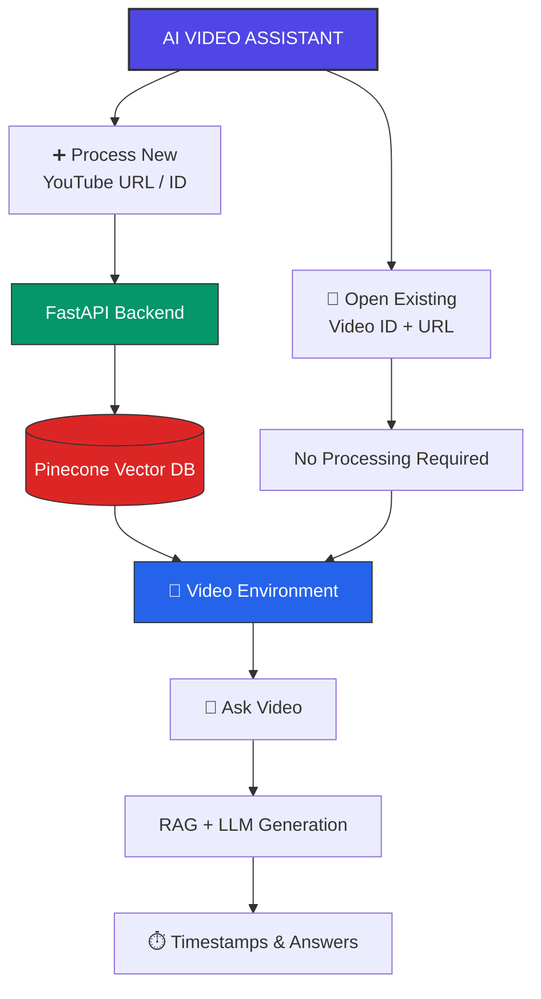

# AI Video Assistant Architecture

## 📊 System Flowchart (Mermaid)

---

## ⚙️ Technical Component Breakdown

*   **FastAPI**: Serves as the core backend API layer. It handles incoming YouTube URLs, downloads/extracts audio transcripts, and coordinates the data pipeline asynchronously.
*   **Pinecone**: A high-performance vector database used to store text embeddings of the video transcripts. It enables semantic search, allowing the system to quickly retrieve relevant video segments.
*   **RAG + LLM**: Retrieval-Augmented Generation. When a user asks a question, the system queries Pinecone for the most relevant transcript segments, injects them into the LLM context, and generates highly accurate answers grounded in the video's content.

---

## 🗺️ User Journey

1.  **Ingestion**: The user either submits a new YouTube link to be processed by the pipeline or opens a previously indexed video instantly using its unique ID.
2.  **Interaction**: Once the video is loaded into the active environment, the user types a natural language question about the content.
3.  **Insight**: The assistant returns an answer backed by **clickable timestamps**, allowing the user to jump directly to the exact moment in the video where the information was spoken.
